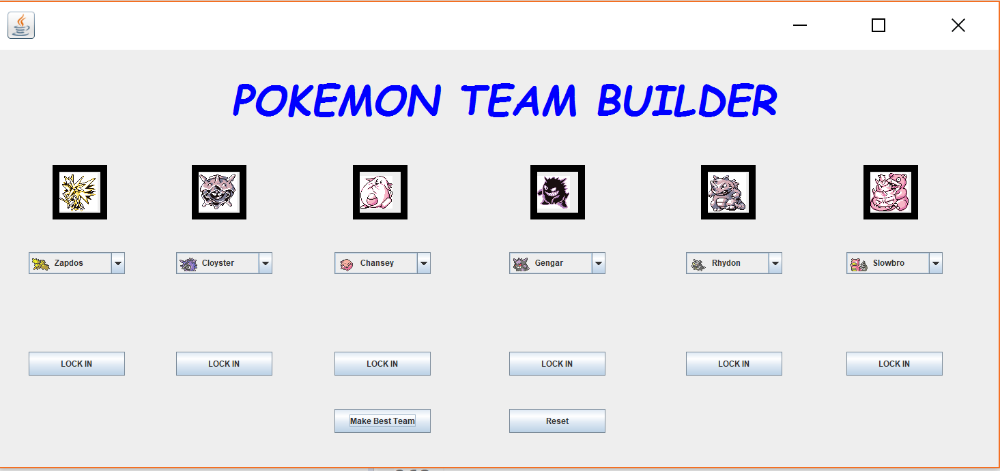

# MW_GroupA

POKEMON TEAM BUILDER

This program will suggest additions to a pokemon team based on your current team. Currently, tier, battle style, and type resistances
are the primary methods of suggesting a pokemon. The recommendation engine also keeps in mind the types already in your team. 

NOTE: The program assumes you are battling in the tier of your highest tiered pokemon. Currently only Generation I pokemon are supported
with the addition of steel, fairy, and dark types.

Offensive strategy is left up to the pokemon trainer. :-)

  

HOW TO USE THE PROGRAM:
1) Use the drop-down menus to select your current team. (for best results, do not skip any spaces, use a left to right approach)
2) LOCK IN your pokemon when you are sure the correct one is loaded.
3) When all your pokemon are locked in, press the "Make Best Team" button. 
4) Your suggested team should now be autopopulated in the program window. 
5) If you would like to unlock pokemon previously selected, or make a new team, press the "Reset" button.
